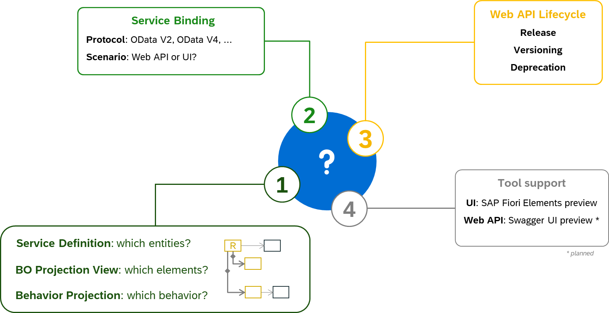

# Step 1 : Introduction to ABAP RESTful Application Programming Model

In this step, you will gain an understanding of the ABAP RESTful Application Programming Model (abbreviated as RAP) by exploring its  core layers i.e. Data Modeling & Behavior, Business Services Provisioning, and Service Consumption. You will review the overall architecture, examine the development flow, and explore different runtime implementation types for business objects. Finally, you'll dive into the specifics of Business Services and Business Objects, providing a solid foundation for working with the model.

 
The ABAP RESTful Application Programming Model consists of three main layers:

1. **Data Modeling & Behavior**
2. **Business Services Provisioning**
3. **Service Consumption**

## 1. Data Modeling & Behavior
The data modeling and behavior layer contains domain-specific business objects, which are defined with Core Data Services (CDS) and transactional behavior.

## 2. Business Services Provisioning
The business service provisioning layer consists of projection views with their projection behavior. These views focus on a particular aspect of the data model, which is exposed as business services through the OData protocol.

## 3. Service Consumption
The service consumption layer allows you to consume all types of OData services as well as OData Web APIs.

  
### First, we'll dive into the architecture overview.
 

    
    
 Architecture Overview - The Big Picture

  
### Now, let's examine the development flow in detail.
 

    
    
 Architecture Overview - Development Flow

  
### Next, let's explore the Business object runtime implementation types.
 

    
    
 Architecture Overview - Development Flow

  
### Finally, let's have a deeper look at Business Service and Business Object.

#### Business Service
 

    
    
 Architecture Overview - Development Flow

#### Business Object
 

    
    
 Architecture Overview - Development Flow

