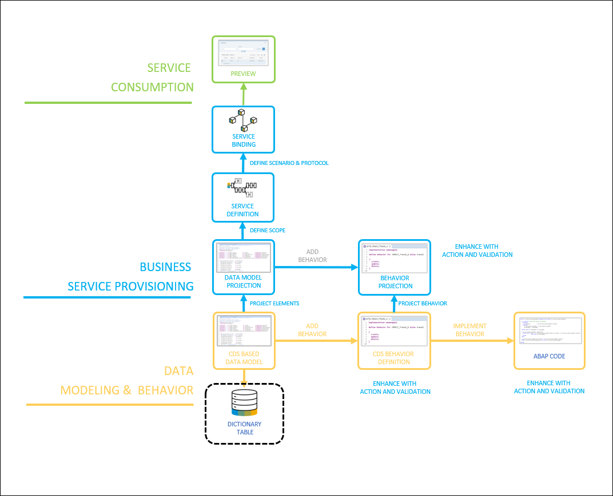
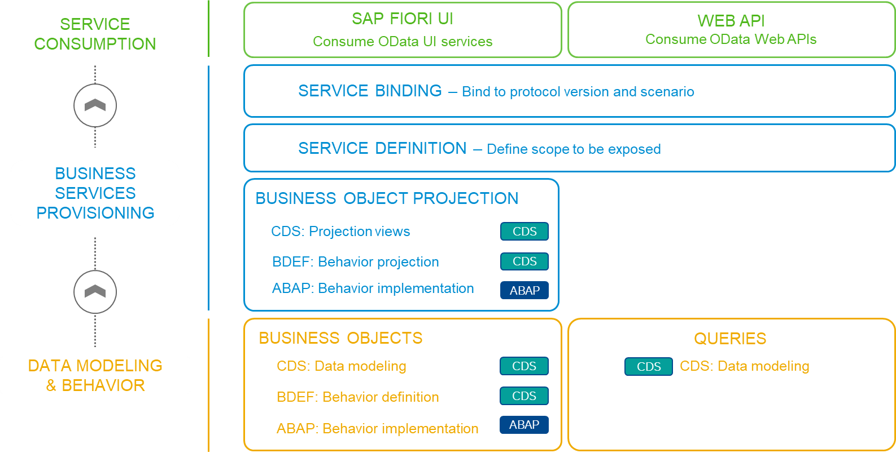

# Step 2 : Setting up the Base Tables for our Data Model

As a part of this step, we’ll take a closer look at the development flow, including the creation of artifacts. The database layer is established through the definition of dictionary tables, which serve as the foundation for our data model
 

    
    
 Setting up Base Dictionary Tables

 

## We shall begin with creating and reusing the following DDIC tables
:warning:**Please note**: the number **xx** represents the assigned serial number to you.

### Custom Tables to Be Created:
- **zfe_employee_xx**: <a href="./Database Table zfe_employee_xx" target="_blank">:link:</a>  Stores employee details for the dummy use case.
- **zfe_empserv_xx**: <a href="./Database Table zfe_empserv_xx" target="_blank">:link:</a> Contains information about employee services and related details.
- **zfe_empstatus_xx**: <a href="./Database Table zfe_empstatus_xx" target="_blank">:link:</a> Tracks employee statuses, such as available, tentative, and occupied.
- **zfe_empeorg_xx**: <a href="./Database Table zfe_empeorg_xx" target="_blank">:link:</a> Holds organizational information for employees.
- **zfe_servstat_xx**: <a href="./Database Table zfe_servstat_xx" target="_blank">:link:</a> Manages the status of various services.

### Standard Tables to Be Reused:
- **t006**: Unit of Measurement
- **tcurc, tcurx**: Currency information

### Report for Data Generation:
- **Z_FE_EMPDATAWRITER_xx**: <a href="./ABAP Program zfe_datawriter_xx" target="_blank">:link:</a>Copy this program to an SE38 report.

<!-- TO DO Add Project specific photos here
  
### First, we'll dive into the architecture overview.
 

    
    
 Architecture Overview - The Big Picture

-->
