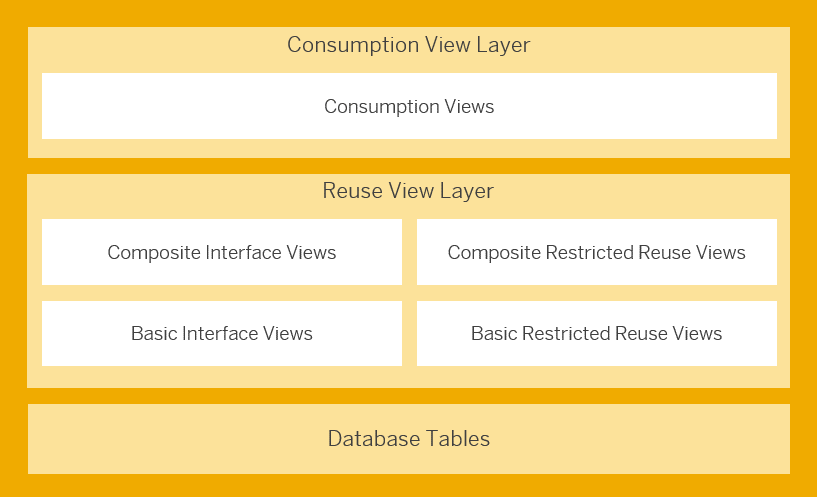

# Step 3 : Basic Interface Core Data Services (CDS) Views

Before we start defining our first and the most basic level of CDS views, lets take a quick look into differnt VDM Layers and View Types.

In the virtual data model, you can differentiate CDS views according to various criteria, such as their position in the VDM layers, their purpose, and their intended reuse.

 

    
    
Layers of the VDM

 

The **database tables** are at the lowest level, and the VDM views are built on top of the database tables to make their content easier to consume. There are two important overarching view types: **Reuse views** and **consumption views**. Reuse views can be divided further into **basic views** and **composite views**.

Lets explore these types deeper

## 1. Basic interface views
**Basic interface views** are placed directly on top of the database tables and are the only views that access the database tables directly. Basic interface views have the following purposes:

- The table fields in the database layer have names that are hard to understand. In the basic interface view layer, they're renamed in terms of business semantics, resulting in more comprehensible field names.

- Basic interface views enrich the data model derived from the underlying database tables with additional metadata, such as annotations and relations between different views.

:bulb: Basic interface views have the annotation **@VDM.viewType: #BASIC**.

## 2. Composite interface views
**Composite interface views** are based on basic interface views and may also have associations to other composite views. They don’t access the database tables directly, but only through the basic view layer.

Composite interface views combine multiple basic interface views or other composite interface views to form new semantic entities. These can be used, for example, as analytical cube views. 

:bulb: Composite interface views have the annotation **@VDM.viewType: #COMPOSITE**

## 3. Restricted reuse views
**Restricted reuse views** are similar to basic or composite interface views, but they're not intended for reuse by customers and partners.
They may have the annotation **@VDM.viewType: #BASIC** or **@VDM.viewType: #COMPOSITE**.

## 4. Consumption Views
The top layer of the VDM CDS view stack is made up of **consumption views**. They're based on reuse views and access the database tables only indirectly through the reuse view layer. These views are designed for a particular purpose with specific requirements, such as use by a particular transactional or analytical app. Consumption views are the only VDM view type that can function as an analytical query.

:bulb: Consumption views have the annotation **@VDM.viewType: #CONSUMPTION**.

Find more info about different CDS View Types at <a href="https://help.sap.com/docs/SAP_S4HANA_ON-PREMISE/ee6ff9b281d8448f96b4fe6c89f2bdc8/0a875bc7a005465aad92c08becc11776.html">SAP Help Doc</a>

  
## As a part of this step, we shall be creating our Basic Interface Core Data Services (CDS) Views
:warning:**Please note**: the number **xx** represents the assigned serial number to you.

### Basic interface views to Be Created:
- **zfe_i_employee_xx**: <a href="./Data Defintion zfe_i_employee_xx" target="_blank">:link:</a>  **Employee** Basic Interface View for FE Demo.
- **zfe_i_empservices_xx**: <a href="./Data Definition zfe_i_empservices_xx" target="_blank">:link:</a> **Employee Services** Basic Interface View for FE Demo.
- **zfe_i_empstatus_xx**: <a href="./Data Definition zfe_i_empstatus_xx" target="_blank">:link:</a> **Employee Status** Basic Interface View for FE Demo.
- **zfe_i_empeorg_xx**: <a href="./Data Definition zfe_i_empeorg_xx" target="_blank">:link:</a> **Employee Organization** Basic Interface View for FE Demo.
- **zfe_i_servicesstatus_xx**: <a href="./Data Definition zfe_i_servicesstatus_xx" target="_blank">:link:</a> **Employee Service Status** Basic Interface View for FE Demo.

### Standard Basic interface views to Be Reused:
- **I_UnitOfMeasure**: Unit of Measurement
- **I_Currency**: Currency information

<!-- TO DO Add Project specific photos here
  
### First, we'll dive into the architecture overview.
 

    
    
 Architecture Overview - The Big Picture

-->
