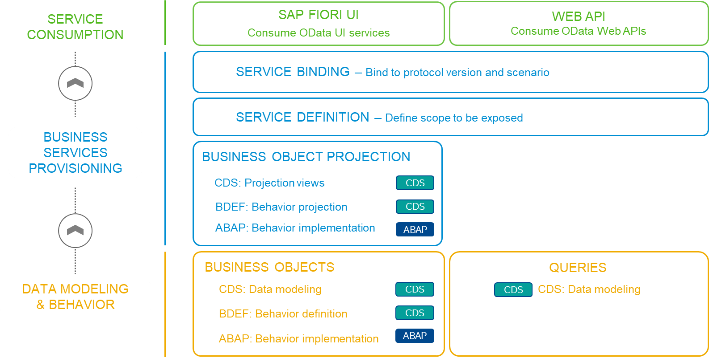

# Step 4 : Composie Interface Core Data Services (CDS) Views

As discussed in Step 3, **Composite interface views** are based on basic interface views and may also have associations to other composite views. They don’t access the database tables directly, but only through the basic view layer.

Composite interface views combine multiple basic interface views or other composite interface views to form new semantic entities. These can be used, for example, as analytical cube views. 

:bulb: Composite interface views have the annotation **@VDM.viewType: #COMPOSITE**

  
## As a part of this step, we shall be creating our Composie Interface Core Data Services (CDS) Views
:warning:**Please note**: the number **xx** represents the assigned serial number to you.

### Composite interface views to Be Created:
- **zfe_i_serv_summary_xx**: <a href="./Data Definition zfe_i_serv_summary_xx" target="_blank">:link:</a>  **Emp Services Summary** Composite Interface View for FE Demo.

<!-- TO DO Add Project specific photos here
  
### First, we'll dive into the architecture overview.
 

    
    
 Architecture Overview - The Big Picture

-->
