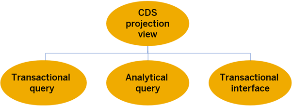

# Step 6 : Create Projection (Consumption) Views

CDS projection views are the **top-most layer of a CDS data model**. They expose data of an underlying CDS data model for a dedicated use case. They correspond to consumption views that make up the C-layer in the Virtual Data Model (VDM) that is used within S/4HANA 

:bulb: Projection views have the annotation **@VDM.viewType: #CONSUMPTION**

    
    
 Creating Projection (Consumption) Views

  
## As a part of this step, we shall be creating our Projection (Consumption) Core Data Services (CDS) Views
:warning:**Please note**: the number **xx** represents the assigned serial number to you.

### Projection Views to Be Created:
- **zfe_c_employee_xx**: <a href="./Data Definition zfe_c_employee_xx" target="_blank">:link:</a> **Employee** Projection View for FE Demo.
- **zfe_r_empservices_xx**: <a href="./Data Definition zfe_c_empservices_xx" target="_blank">:link:</a> **Emp Services** Projection View for FE Demo.

<!-- TO DO Add Project specific photos here
  
### First, we'll dive into the architecture overview.
 

    
    
 Architecture Overview - The Big Picture

-->
