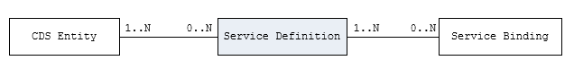

# Step 8 : Create Service Binding

The **business service binding** (short form: service binding) is an ABAP Repository object used to **bind a service definition to a client-server communication protocol such as OData**. Like any other repository object, the service binding uses the proven infrastructure of the ABAP Workbench, including the transport functionality.

## Use
As shown in the figure below, a service binding relies directly on a service definition that is derived from the underlying CDS-based data model. Based on an individual service definition, a plurality of service bindings can be created. The separation between the service definition and the service binding enables a service to integrate a variety of service protocols without any kind of re-implementation. The services implemented in this way are based on a separation of the service protocol from the actual business logic.

    
    
 Creating Service Binding

  
## As a part of this step, we shall be creating our Service Binding to bind our service definition zui_c_employee_services_xx to OData service.
:warning:**Please note**: the number **xx** represents the assigned serial number to you.

### Transactional views to Be Created:
- **zui_c_employee_services_xx**

    
    
 Creating Service Binding

<!-- TO DO Add Project specific photos here
  
### First, we'll dive into the architecture overview.
 

    
    
 Architecture Overview - The Big Picture

-->
